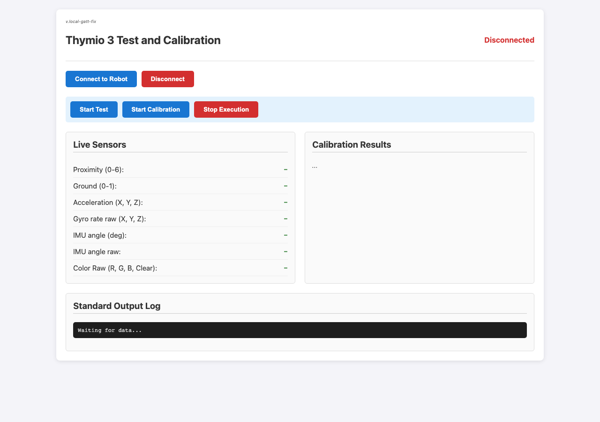

# Thymio 3 Calibration App

Local production test/calibration tool for Thymio 3, with a patched Web Bluetooth upload path that fixes:

`Failed to send script: GATT operation failed for unknown reason.`

Based on the production page from [Mobsya/thymio3-ts-api](https://github.com/Mobsya/thymio3-ts-api/tree/production), with a vendored/patched API under `vendor/thymio3-api/`.

## Demo



### Typical workflow

1. Run the app locally (`npm run dev`) and open **http://localhost:5173** in Chrome.
2. Click **Connect to Robot** and select your Thymio 3 in the Web Bluetooth picker.
3. Live sensors start streaming automatically (proximity, ground, acceleration, color).
4. Click **Start Calibration** (or **Start Test**).
   - An overlay shows script upload packet progress.
   - Sensor streaming is paused during upload, then restored.
5. Watch the **Standard Output Log** and **Calibration Results** panel.
   - Success: green panel + `calibration completed successfully!`
   - Timeout / failure: red LEDs on the robot + `calibration timeout!` in the log
6. Use **Stop Execution** to halt a running script, or **Disconnect** when finished.

> Web Bluetooth requires a secure context (`localhost` or HTTPS) and a Chromium-based browser. A physical Thymio 3 is required — the UI alone cannot simulate calibration.

## Fixes vs upstream

- Default write MTU **182** (instead of 500), connect-time probe, and MTU halving fallback
- Sensor streaming paused during script upload
- Soft-reset before upload
- GATT write retries with backoff
- Wait for robot Python load acknowledgement before execute
- Packet upload progress in the UI
- Ground calibration API compatible with firmware **1.8.4** (`set_calibration_all` / `save_calibration`)

## Requirements

- Chrome or Edge (Web Bluetooth)
- Node.js 18+
- A Thymio 3 nearby

## Run

```bash
npm install
npm run dev
```

Open **http://localhost:5173**, connect to the robot, then run **Start Test** or **Start Calibration**.

## Layout

```
src/main.js              # UI + upload flow
src/scripts/test.py      # production test script
src/scripts/calib.py     # production calibration script
vendor/thymio3-api/      # patched Thymio 3 TS API
docs/demo-ui.png         # README demo screenshot
docs/arena-A4-v2.pdf     # print this to build the test arena
```

## Test arena

Print [`docs/arena-A4-v2.pdf`](docs/arena-A4-v2.pdf) (A4) to assemble the physical calibration arena (corridor + ground stripe markings).

## Notes

- Prefer Chrome. Safari does not support Web Bluetooth.
- Keep the robot close during script upload.
- Successful calibrations are saved to flash; failed / unreached items are not. The final log report lists `SAVED` / `NOT SAVED` per item.
